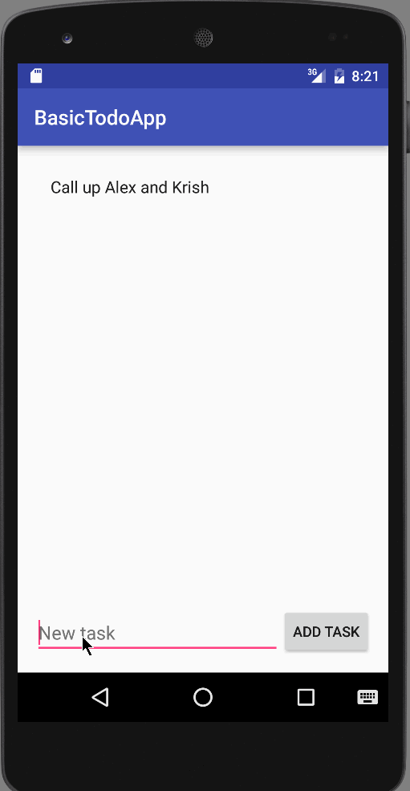

# Android-TodoListApp
CodePath assignment of Basic Todo App in Android. 15th Nov.2015. 

Time Spent: 10 hours

Completed User Stories

* [x] Required: Show Todo tasks list. 
* [x] Required: Add tasks to the list.
* [x] Required: Delete tasks from the list. 
* [x] Required: Edit the tasks in a seperate Edit Activity. 
* [x] Required: Persist the data to a file. 

Note:
Added toast message for all the important events like the add, delete and edits in the tasks.

Here is the walk through of all the user stories

GIF created with [LiceCap](http://www.cockos.com/licecap/).

Many thanks to the CodePath Team!

Thank You!!

Saurabh

